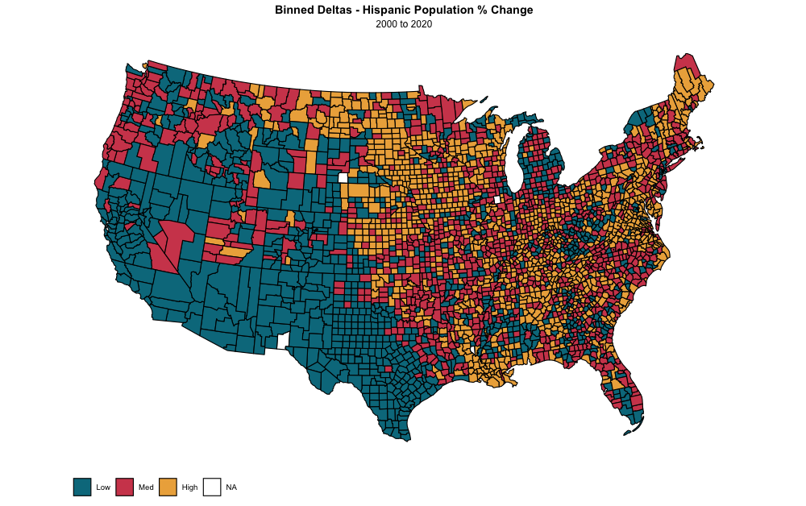
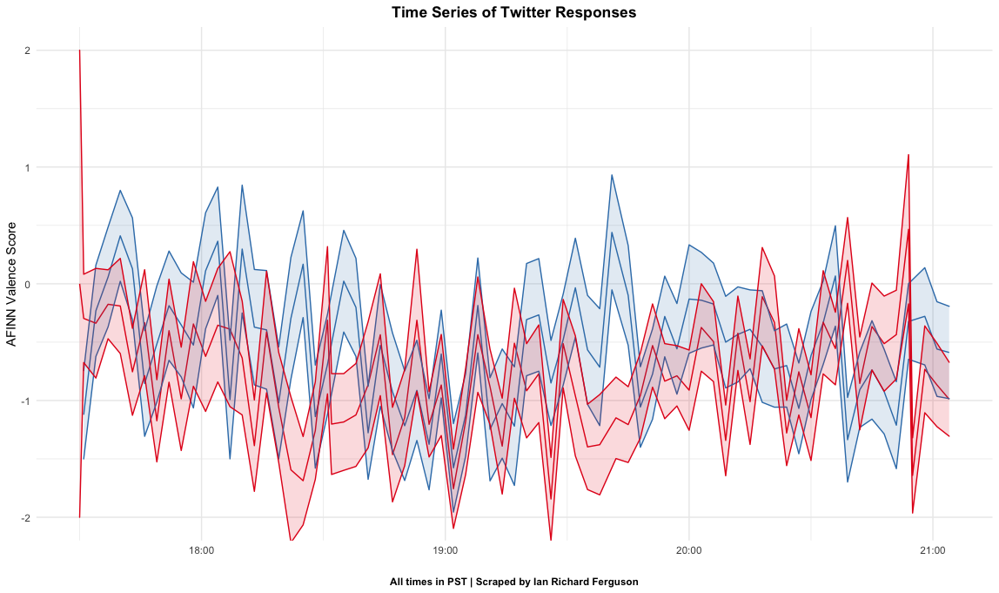
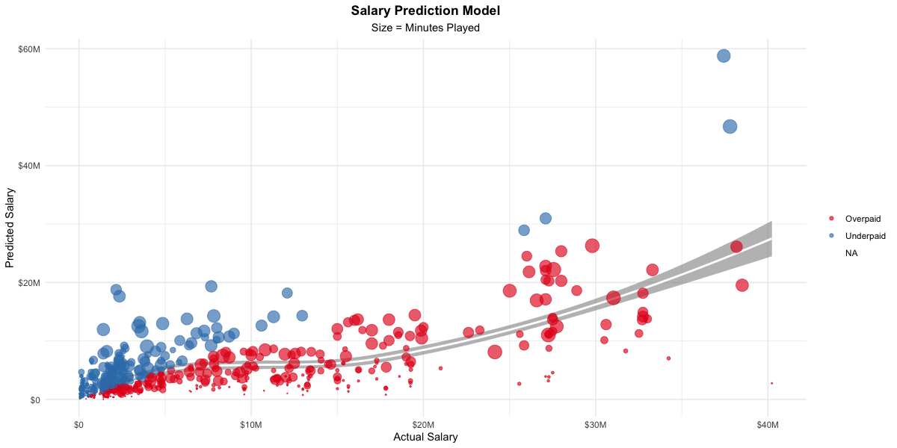
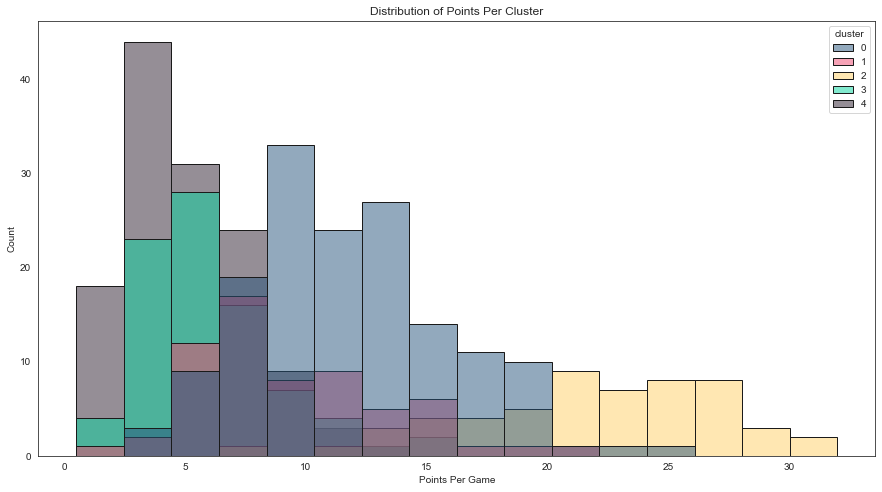
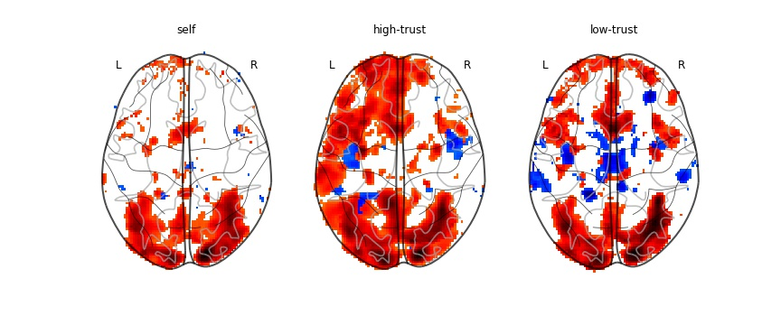

# Ian Richard Ferguson, M.A.
## Data Science Portfolio

Howdy! This repository is a collection of various projects (and works in progress!) that I believe accurately highlight my skill-set and research interests.

### Find me Online

* <a href="https://github.com/IanRFerguson/data-science-portfolio/blob/main/FERGUSON-Resume.pdf" target="_blank">**Resume**</a>
* <a href="https://www.linkedin.com/in/ianrferguson/" target="_blank">**LinkedIn**</a>
* <a href="https://ianrferguson.com" target="_blank">**On the Web**</a>

Thanks for looking, have a nice day!

## us-demographic-shifts

In an ongoing project, I am exploring the degree to which long-term, county-level demographic changes correlate with behavioral outcomes (hate speech, violence towards racial minorities).

### Methods

* County-level demographic data obtained via Census API
* Population deltas calculated between 2000 and 2020 using `dplyr`
* Counties binned as low- mid- or high-dynamic areas based on Hispanic population % changes using `mltools`
* *n* number of tweets scraped from random sample of each bin via `tweepy` library
* Hate speech classifier trained and applied to dataset using `sci-kit learn`

<a href="https://github.com/IanRFerguson/demographic-driven-conservative-shift" target="_blank">**Link to repository**</a>

   

## debate-night-performances

This project quantifies aggregate responses to Joe Biden and Donald Trump on Debate Night during the 2020 election season. 

### Methods
* Custom `Python` script deployed to scrape **"Trump"** and **"Biden"** keyword tweets every minute
* Tweets were tokenized and cleaned using `dplyr` and `tidytext` libraries in `R`
* AFINN polarity averaged per tweet, and polar responses averaged per candidate per timepoint
* Affective trends smoothed and visualized to create more meaningful trendlines

<a href = "https://github.com/IanRFerguson/data-science-portfolio/tree/main/debate-night-performances" target="_blank">**Link to project**</a>

   

## salary-model

This project seeks to model NBA players' salaries based on their on-court performance

### Methods
* NBA player stats and salaries scraped from Basketball Reference using `pandas`
* Data cleaned and transformed using `dplyr`
* Salary model fit using `MASS` and predictive features identified using AIC stepwise variable selection
* Analysis conducted per team to identify ratio of overpaid / underpaid players

<a href="https://github.com/IanRFerguson/data-science-portfolio/blob/main/salary-model/model_salaries.ipynb" target="_blank">**Link to project**</a>

   

## nba-new-age

Professional basketball is increasingly becoming positionless, and this project seeks to quantify that trend using contemporary Machine Learning approaches (namely PCA and k-Means Clustering)

### Methods
* Data scraped from Basketball Reference and cleaned using standard methods (mean imputation, filtering, etc.)
* All features were normalized and decomposed into two components using PCA
* Low-dimensional data grouped together using K-Means clustering
* Cluster labels projected up to high-dimensional data to better understand meaningful trends in basketball terms

<a href = "https://github.com/IanRFerguson/data-science-portfolio/blob/main/nba-new-age/positionless-basketball.ipynb" target="_blank">**Link to project**</a>

   

## automated-neuroimaging-pipeline

This project builds on the `NiPy` ecosystem, and is optimized to allow the user to modify first- and group-level analyses via an external JSON file. My first foray into object-oriented Python!

<a href="https://github.com/IanRFerguson/scp-fmri-analysis-2019" target="_blank">**Link to repository**</a>
